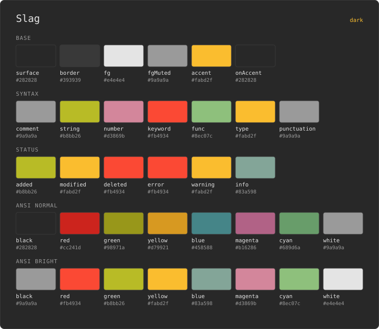
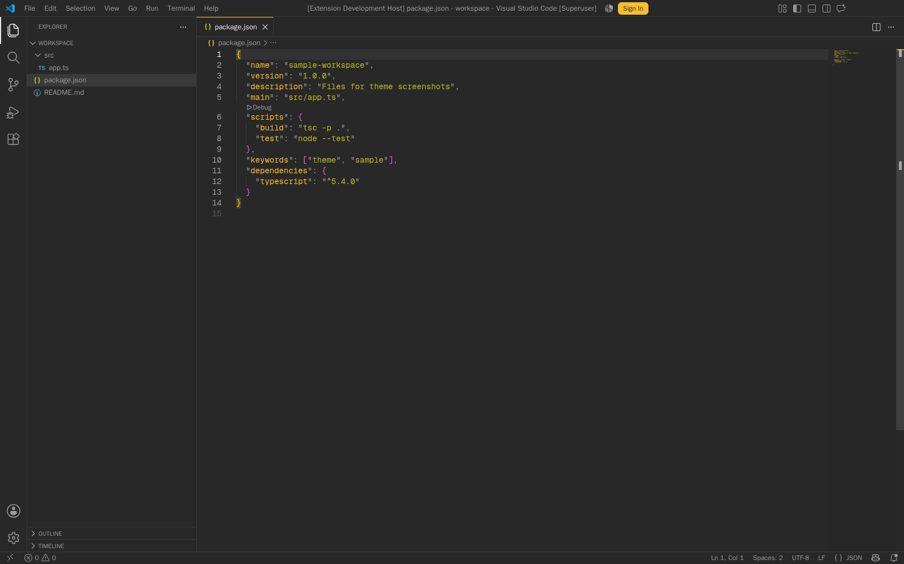
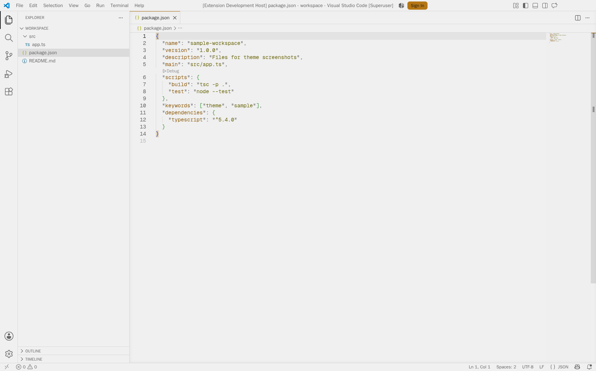
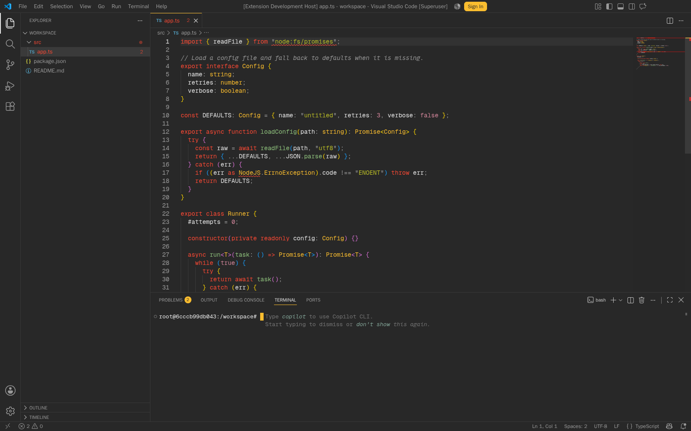
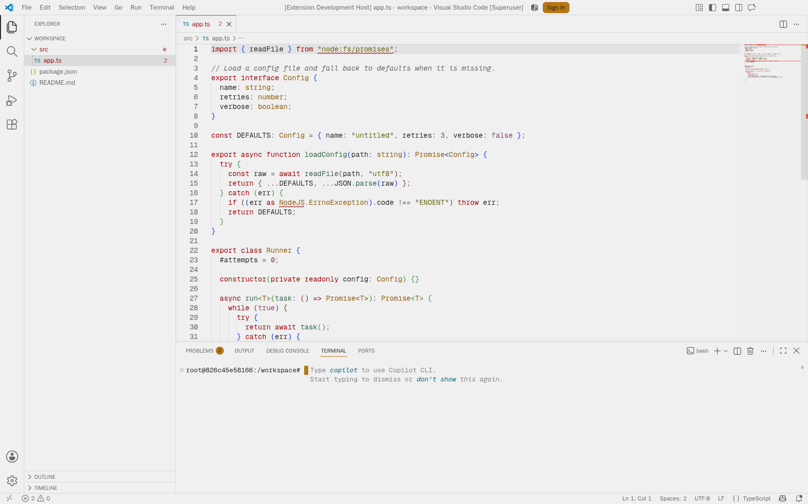

# joeboylson_dotfiles

My **personal** dotfiles. Managed with [GNU Stow](https://www.gnu.org/software/stow/).
Works on **macOS** and **Linux**.

## Slag

One palette, generated into every tool. The sheet below is drawn from the same
source as the themes, so it can't drift from them.

<picture>
  <source media="(prefers-color-scheme: light)" srcset="docs/slag-light.svg">
  
</picture>

| Dark | Light |
| ---- | ----- |
|  |  |
|  |  |

## Required packages

- **stow**
  - macOS: `brew install stow`
  - Debian/Ubuntu: `sudo apt install stow`
  - Fedora: `sudo dnf install stow`
  - Arch: `sudo pacman -S stow`

## Usage

Each top-level folder is a stow package that mirrors `~`, with two exceptions:
`theme-forge` is source and `docs` is generated README art, so never stow either.
Run stow from the repo root with the target set to your home directory (portable
across macOS/Linux):

```bash
stow -t ~ tmux      # symlink this package into ~
stow -t ~ -D tmux   # remove the symlinks
stow -t ~ -R tmux   # restow after changes
```

Use `--no-folding` for the `claude` package:

```bash
stow --no-folding -t ~ claude
```

Without it, stow links whole directories when it can, so `~/.claude/skills`
would become a single symlink into this repo and nothing else could add a skill
there. `--no-folding` makes stow create real directories and link each file, so
other repos can drop their own skills alongside these.

## Packages

| Package     | Links |
| ----------- | ----- |
| `tmux`      | `~/.tmux.conf` |
| `claude`    | `~/.claude/commands/`, `~/.claude/skills/slag-design-system/` |
| `alacritty` | `~/.config/alacritty/slag.toml`, `slag-light.toml` |
| `nvim`      | `~/.config/nvim/colors/slag.lua`, `slag-light.lua` |
| `vscode`    | `~/.vscode/extensions/slag/` |
| `polybar`   | `~/.config/polybar/` (config, scripts, `slag.ini`, `slag-light.ini`) |
| `rofi`      | `~/.config/rofi/config.rasi`, `themes/slag.rasi`, `slag-light.rasi` |
| `fontconfig`| `~/.config/fontconfig/conf.d/60-geist.conf` |

`theme-forge` is not in this table on purpose — it is the palette source that
generates `alacritty`, `nvim`, `vscode`, and the color files in `polybar` and
`rofi`, and nothing in it belongs in `~`.

## Slag theme

`alacritty`, `nvim`, `vscode`, `polybar` and `rofi` all carry the same theme, in
dark and light. The theme files are generated from a single palette in
`theme-forge`, so never edit them by hand (`polybar/.../slag*.ini`,
`rofi/.../themes/slag*.rasi`) — the next build overwrites them. To change the theme:

```bash
cd theme-forge
$EDITOR presets/slag.mjs        # or palette.mjs, the default preset
node package.mjs                # writes theme-forge/dist/dotfiles
cp -R dist/dotfiles/* ..        # sync into the stow packages
```

`theme-forge/dist` and the other build output are gitignored; only the synced
copies in the stow packages are tracked.

After stowing:

- **Alacritty** — add to `alacritty.toml`:
  `general.import = ["~/.config/alacritty/slag.toml"]`
- **Neovim** — `:colorscheme slag` (or `slag-light`)
- **VS Code** — reload the window, then pick "Slag" in the theme picker
- **Polybar** — `config.ini` already has `include-file = ~/.config/polybar/slag.ini`;
  point it at `slag-light.ini` for light, then `polybar-msg cmd restart`
- **Rofi** — `config.rasi` already has `@theme "~/.config/rofi/themes/slag.rasi"`;
  change it to `slag-light.rasi` for light

## Polybar and fonts (Linux / XFCE)

`polybar/.config/polybar/config.ini` and `rofi/.config/rofi/config.rasi` are
hand-written and only reference the generated theme files, so layout, modules
and icon fonts stay yours while the colors follow the palette. In `config.ini`
use `${colors.*}` names (`primary`, `on-primary`, `ok`, `warn`, `crit`, …), never
raw hex. The font is set in `font-0`/`font-1` in `config.ini`; rofi's comes from
the palette's `font.family` (Geist Mono).

Geist and Geist Mono aren't bundled. Install them first (OFL, from
<https://github.com/vercel/geist-font/releases>) into `~/.local/share/fonts`,
then stow `fontconfig` and run `fc-cache -f`. XFCE ignores fontconfig for its
own UI, so set those by hand:

```bash
xfconf-query -c xsettings -p /Gtk/FontName -s "Geist 10"
xfconf-query -c xsettings -p /Gtk/MonospaceFontName -s "Geist Mono 10"
xfconf-query -c xfwm4 -p /general/title_font -s "Geist Bold 9"
```

## Publishing the VS Code theme

Tagging is the whole release. CI packages the extension and pushes it to the
VS Code Marketplace and Open VSX:

```bash
git tag slag-v0.1.0 && git push origin slag-v0.1.0
```

The tag only triggers the run — `vscode/.vscode/extensions/slag/package.json`
holds the real version, and CI fails the release if the two disagree. Bump it in
`theme-forge/package.mjs`, regenerate, sync, commit, then tag.

To test the packaging without shipping, run the workflow manually from the
Actions tab; it builds the `.vsix` and attaches it as an artifact.

`VSCE_PAT` (Azure DevOps, Marketplace > Manage) is required. `OVSX_PAT`
(open-vsx.org) is optional — without it the release goes to the VS Code
Marketplace only, and Cursor and VSCodium users won't find the theme.
